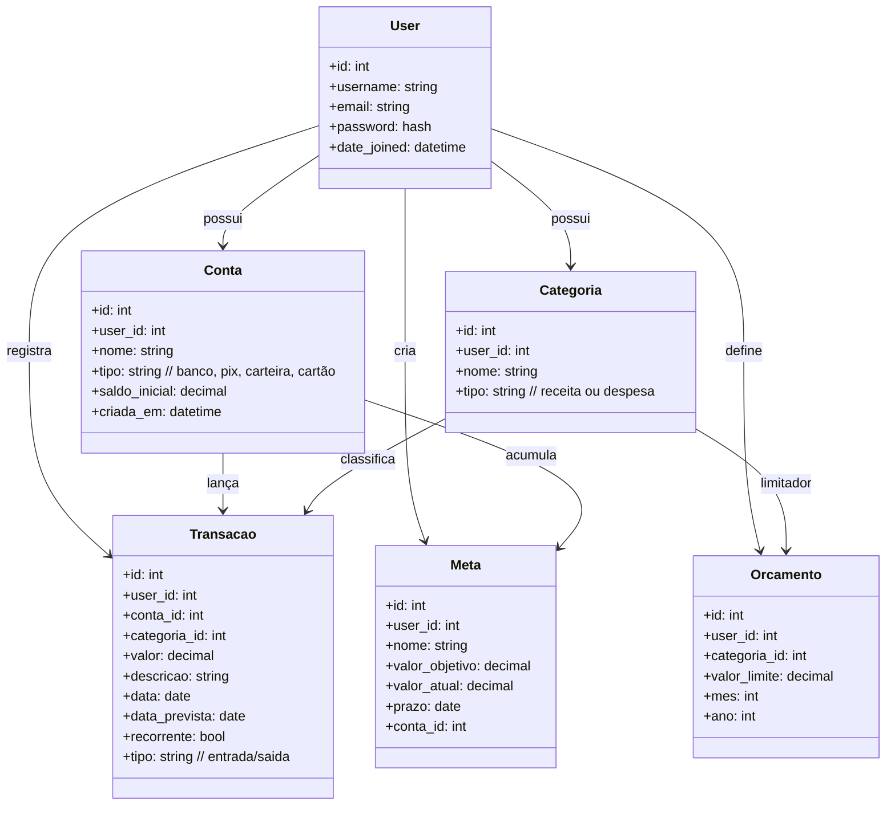

---

### **Usuários**

Cada usuário possui e gerencia seus próprios dados financeiros.

**Funcionalidades:**

* Autenticação (login/logout)
* Registro de usuário
* Cada usuário possui seus próprios:

  * contas
  * categorias
  * transações
  * orçamentos
  * metas

Não existe compartilhamento de dados entre usuários.

---

### **Contas**

Representam onde o dinheiro do usuário está guardado.

Exemplos: conta bancária, carteira, poupança, cartão, Pix.

**Funcionalidades:**

* Criar contas
* Editar contas
* Excluir contas
* Gerenciar saldo inicial
* Visualizar todas as contas com seus saldos
* Relacionar contas com transações e metas

---

### **Categorias**

Organizam as transações em tipos específicos.

Exemplos: Mercado, Transporte, Salário, Lazer.

**Funcionalidades:**

* Criar categorias de **receita** ou **despesa**
* Editar e excluir categorias
* Filtros por categoria nas transações
* Vincular categorias aos orçamentos

---

### **Transações**

Coração do sistema: entradas e saídas do fluxo financeiro.

**Funcionalidades:**

* Registrar entradas e saídas
* Associar transações a contas e categorias
* Criar transações **previstas** (futuras)
* Marcar como **recorrente** (geração automática mensal/semanal/etc.)
* Editar e excluir transações
* Filtrar por intervalo de datas, contas ou categorias
* Visualizar impacto no saldo atual e futuro

---

### **Orçamentos**

Limites mensais para gastos em categorias específicas.

**Funcionalidades:**

* Criar limite mensal para uma categoria
* Definir valor máximo por mês/ano
* Comparar limite vs. gastos realizados
* Indicar se o mês está:

  * dentro do limite
  * quase estourando
  * excedido
* Visualizar desempenho dos orçamentos do mês

---

### **Metas**

Objetivos financeiros do usuário: juntar dinheiro aos poucos.

Exemplos: “Notebook 4500”, “Emergência 10000”.

**Funcionalidades:**

* Criar metas com valor objetivo e prazo
* Acompanhar progresso (valor atual vs. objetivo)
* Associar a meta a uma conta específica
* Atualizar quanto já foi guardado
* Mostrar porcentagem concluída
* Indicar se o usuário está no ritmo certo para atingir o objetivo